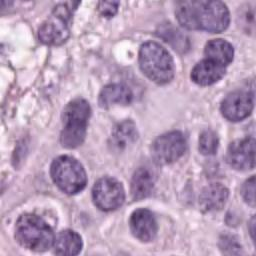
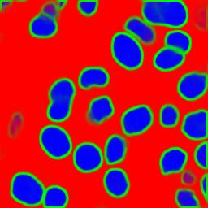

# This Repository was created to test Deep ICY

|  | 
|:--:| 
| *Image from PanNuke Dataset $~~~~~~~~~~~~~~~$    Nuclei segmentation result* |  

 <!-- | |

 | *Segmentation result* | -->

<!-- 

|:--:|  -->

<!-- | *Segmentation result* | -->

The model used is a simple UNet with 3 channels as input and 3 channels as output.
model was trained on PanNuke Dataset with the TI loss (https://github.com/TopoXLab/TopoInteraction):

The goal is to segment nuclei.

#### There are 3 classes as output:

0: Background pixels

1: Nuclei contours

2: Nuclei

## Pre-processing:

just normalize the image between [0,1] by dividing by 255.

## Post-processing:
Apply exponential to the output of the model.

## Test

In test_deep_icy_model.ipynb 
you can try the model with and example image.

